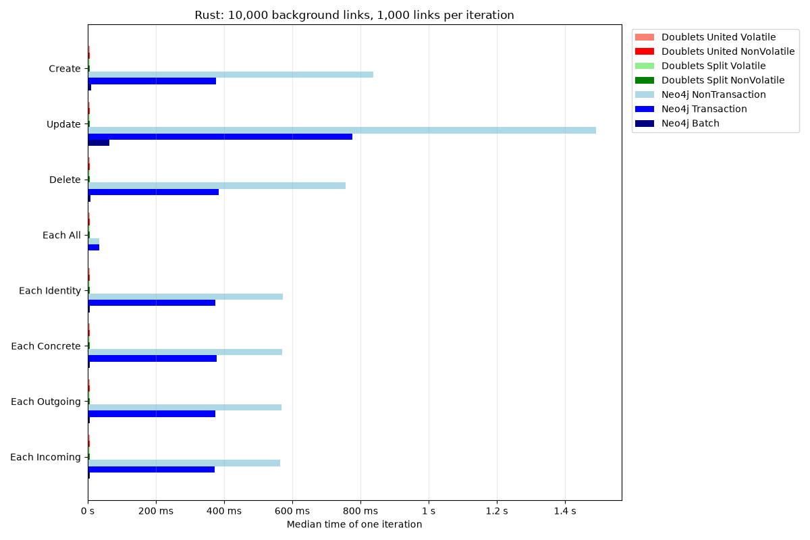
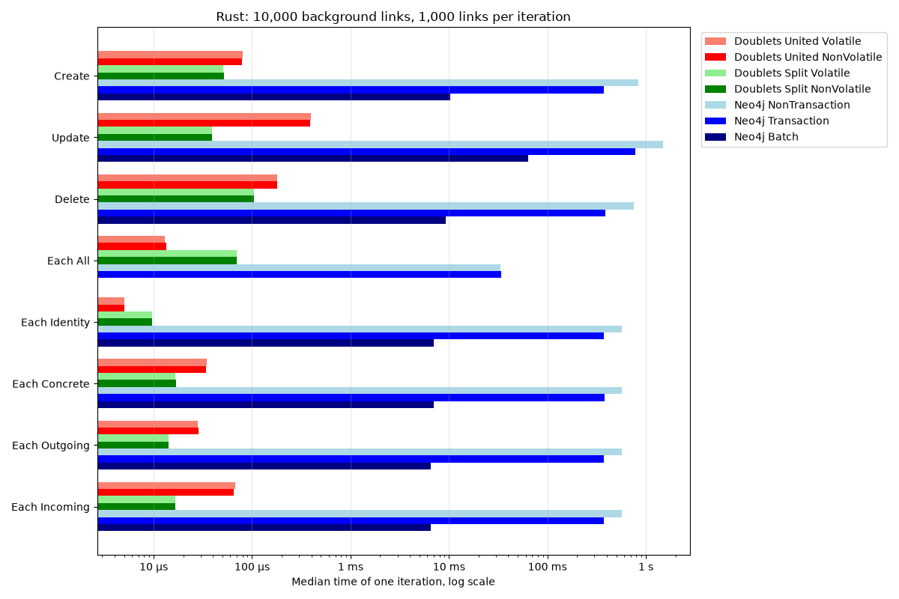
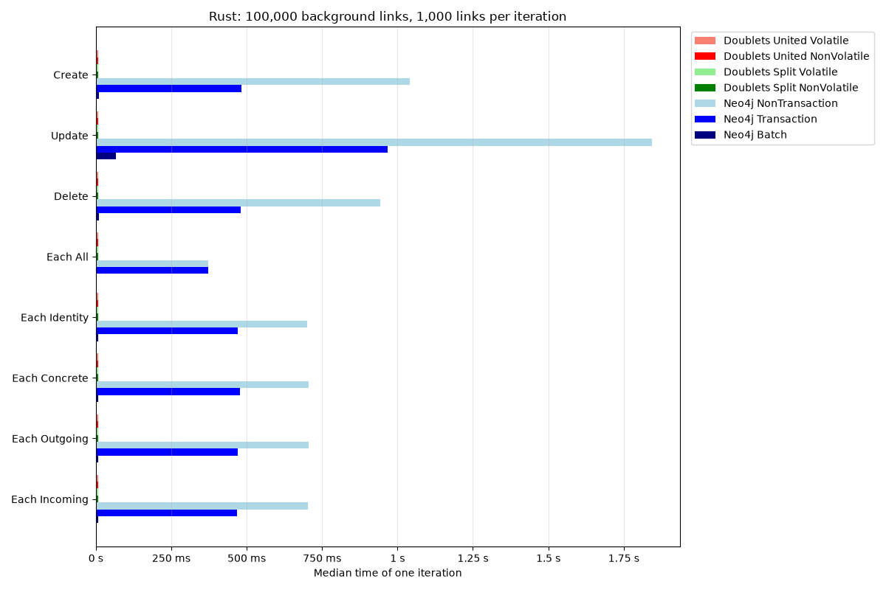
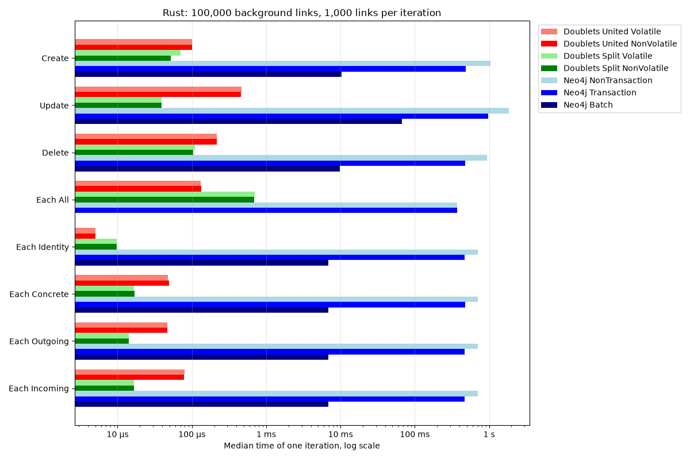
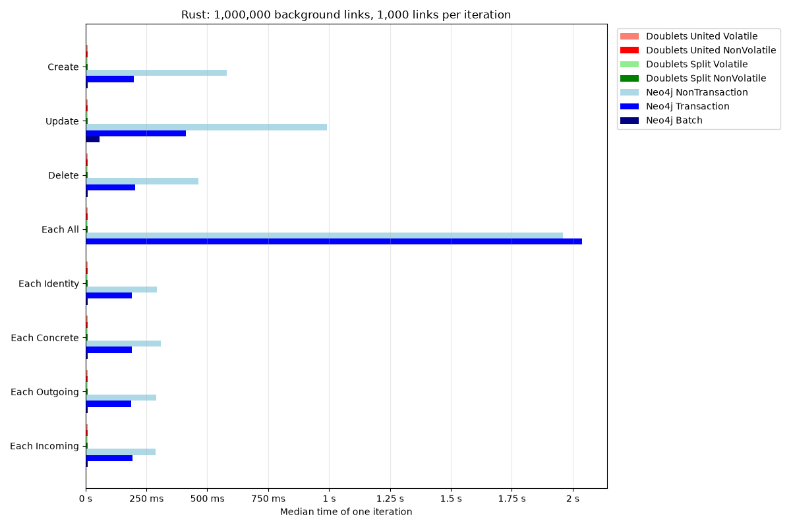
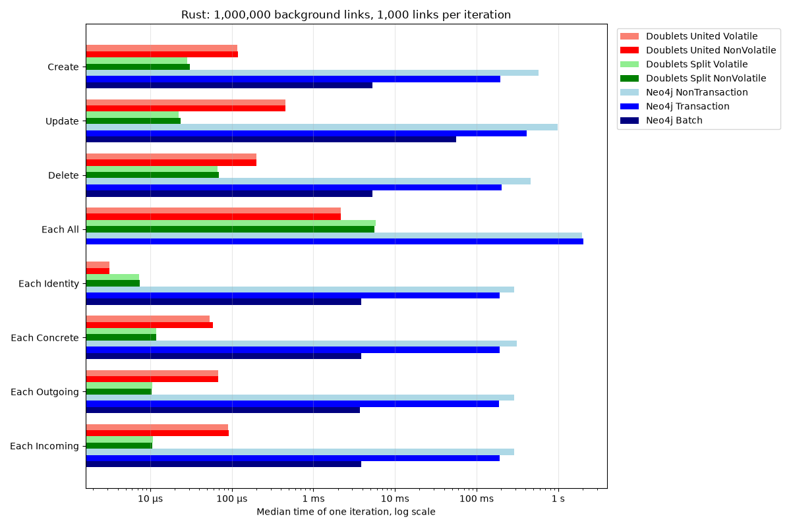

# Comparisons.Neo4jVSDoublets

This repository measures how long basic operations on links take in two
databases, with the same benchmarks written in two languages:

| Language | Neo4j 2026.09 Community Edition (default settings)                     | Doublets (LinksPlatform, in the benchmark process)                                  |
|----------|------------------------------------------------------------------------|-------------------------------------------------------------------------------------|
| Rust     | [neo4rs](https://github.com/neo4j-labs/neo4rs) Bolt driver             | [doublets](https://crates.io/crates/doublets) crate                                 |
| C#       | official [Neo4j.Driver](https://www.nuget.org/packages/Neo4j.Driver)   | [Platform.Data.Doublets](https://www.nuget.org/packages/Platform.Data.Doublets) package |

A link (doublet) is a triple `(id, source, target)`. In each language both
databases implement the same interface (the [`Doublets`](https://docs.rs/doublets)
trait in Rust, [`IBenchedLinks`](csharp/Neo4jVSDoublets/IBenchedLinks.cs) in
C#), and every benchmark calls the same methods on all of them. Both languages
send the same Cypher statements and run the same operations with the same
sizes, so their results can be compared with each other.

The measured value is the time until an operation is finished from the point
of view of the caller. Two workloads are reported:

- **One operation per call**: every link operation is a separate call through
  the `Doublets` interface, as an application calls it one at a time.
- **Batch** (Neo4j only): the same operations of an iteration are sent to
  Neo4j as one list in one Cypher statement, so the fixed cost of a statement
  (round trips, query planning, commit) is paid once per iteration instead of
  once per operation. Doublets has no batch calls; its batch work is the same
  sequence of function calls as in the first workload.

## What is compared

| Implementation                | Where the data is                          | A finished operation is                            |
|-------------------------------|--------------------------------------------|----------------------------------------------------|
| `Doublets_United_Volatile`    | RAM of the benchmark process               | in RAM                                             |
| `Doublets_United_NonVolatile` | memory-mapped file                         | in the OS page cache (no `fsync`)                  |
| `Doublets_Split_Volatile`     | RAM of the benchmark process               | in RAM                                             |
| `Doublets_Split_NonVolatile`  | two memory-mapped files                    | in the OS page cache (no `fsync`)                  |
| `Neo4j_NonTransaction`        | Neo4j server, reached over Bolt (TCP)      | committed: every statement is its own transaction  |
| `Neo4j_Transaction`           | Neo4j server, reached over Bolt (TCP)      | committed: one explicit transaction per iteration  |
| `Neo4j_Batch`                 | Neo4j server, reached over Bolt (TCP)      | committed: one statement with all `N` operations   |

- **United** and **Split** are two Doublets storage layouts: link data and
  index trees in one array, or in two separate arrays.
- Neo4j can only be reached over the network, so every Neo4j operation
  includes at least one round trip to the server. Doublets has no server: its
  operations are function calls on the process memory. The comparison
  therefore shows the cost of each way of storing links as it is used, not the
  cost of the storage engines alone.
- Neo4j writes every commit to its transaction log on disk. The Doublets stores
  do not call `fsync`.

## Operations

| Operation     | `Doublets` method            | Neo4j (Cypher, one statement)                              | Doublets                                     |
|---------------|------------------------------|------------------------------------------------------------|----------------------------------------------|
| Create        | `create_point()`             | `CREATE (:Link {id: $id, source: $id, target: $id})`       | write the link, insert it into both trees    |
| Update        | `update(id, source, target)` | `MATCH (l:Link {id: $id}) ... SET l.source = ..., l.target = ...` | remove from both trees, write, insert  |
| Delete        | `delete(id)`                 | `MATCH (l:Link {id: $id}) ... DELETE l`                    | remove from both trees, mark as free         |
| Each All      | `each([*, *, *])`            | `MATCH (l:Link) RETURN ...`                                | scan the array                               |
| Each Identity | `each_by([id, *, *])`        | `MATCH (l:Link) WHERE l.id = $id RETURN ...`               | read array element `id`                      |
| Each Concrete | `each_by([*, source, target])` | `MATCH (l:Link) WHERE l.source = $source AND l.target = $target RETURN ...` | search the `(source, target)` tree |
| Each Outgoing | `each_by([*, source, *])`    | `MATCH (l:Link) WHERE l.source = $source RETURN ...`       | walk the `(source, target)` tree             |
| Each Incoming | `each_by([*, *, target])`    | `MATCH (l:Link) WHERE l.target = $target RETURN ...`       | walk the `(target, source)` tree             |

In Neo4j a link is a node `(:Link {id, source, target})`. A link is found by
its `id` property, which has a uniqueness constraint and therefore an index;
`source` and `target` have indexes too. The internal node id (`elementId`) is
not used as the link id, because Neo4j chooses it itself and may reuse it,
while link ids are chosen by the caller. Update and Delete are single
statements that also return the previous `source` and `target`, which the
`Doublets` interface reports.

`Neo4j_Batch` sends the `N` operations of an iteration as a list parameter
and runs them with `UNWIND`, for example
`UNWIND $ids AS id MATCH (l:Link {id: id}) DELETE l`. Neo4j finds each link of
the list with the same index seek as the single statement. Update is two
statements (to `(0, 0)` and back), every other operation one. Each All is
already one statement, so it has no batch variant.

The exact statements and data structures are documented in
[`rust/src/neo4j_impl.rs`](rust/src/neo4j_impl.rs) and
[`rust/src/doublets_impl.rs`](rust/src/doublets_impl.rs), and for C# in
[`csharp/Neo4jVSDoublets/Neo4jLinks.cs`](csharp/Neo4jVSDoublets/Neo4jLinks.cs) and
[`csharp/Neo4jVSDoublets/DoubletsLinks.cs`](csharp/Neo4jVSDoublets/DoubletsLinks.cs).
The C# names of the operations are `CreatePoint`, `Update`, `Delete` and
`Each(id, source, target, visit)`.

## Method

- `B` (background links) point links `1..=B` exist before every iteration, so
  the indexes have a realistic size.
- One iteration performs `N` (links per iteration) operations:

  | Benchmark     | One iteration                                                  |
  |---------------|----------------------------------------------------------------|
  | Create        | creates `N` links (ids `B + 1..=B + N`)                        |
  | Update        | `N` × (`update(id, 0, 0)` and `update(id, id, id)`) = `2N` updates |
  | Delete        | deletes links `B` down to `B - N + 1`                          |
  | Each All      | one query that returns all `B` links                           |
  | Each Identity, Each Concrete, Each Outgoing, Each Incoming | `N` queries, for ids `1..=N`, each returning one link |

- The measured time of an iteration starts before the transaction begins and
  ends after it is committed (for `Neo4j_Transaction`). After the measurement
  the changes of the iteration are undone (Create is undone by deleting the
  created links, Delete by creating them again), so every iteration starts
  from the same links. The undo is not measured.
- The background links are created once per benchmark and are not measured.
- [Criterion.rs](https://github.com/bheisler/criterion.rs) collects the
  samples: 10 samples (at least 5 s) for Neo4j, 100 samples for Doublets. The
  tables show the median time of one iteration.
- The C# benchmarks sample the same way: their
  [harness](csharp/Neo4jVSDoublets/Harness.cs) warms up and chooses the
  number of iterations of every sample with the formulas of Criterion 0.8
  (flat sampling for Neo4j, linear for Doublets), and prints the same
  `bencher` lines (median and standard deviation), so one script reports both
  languages.
- The CI runs every language, database and number of background links in its
  own GitHub Actions job (a separate virtual machine), so they do not compete
  for the same CPU. Neo4j runs in the official `neo4j:2026.09-community`
  Docker image without configuration changes.
- Before the benchmarks, tests check that all seven implementations return the
  same results and that undoing an iteration restores the links
  ([`rust/tests/same_behavior.rs`](rust/tests/same_behavior.rs),
  [`csharp/Neo4jVSDoublets.Tests/SameBehaviorTests.cs`](csharp/Neo4jVSDoublets.Tests/SameBehaviorTests.cs)).

Benchmarks on the main branch use `N = 1,000` and `B` = 10,000, 100,000 and
1,000,000; such a run takes about 12 minutes on GitHub Actions (the longest
job, Neo4j with 1,000,000 background links, about 11 minutes). Pull requests
run a quick check with `N = 100` and `B = 1,000`. Larger `B` are not possible
with the Rust doublets 0.5.0 (see [Limitations](#limitations)). Changes that do not
touch the code, such as this README, start no tests or benchmarks.

## Results

The results below are generated by the CI on every change of the benchmark
code on the main branch. Every cell is the median time of one iteration
(`N` operations), rounded to three significant digits.

- **Bold** marks the fastest Neo4j implementation of each operation (usually
  `Neo4j_Batch`; for Each All, which has no batch variant, the faster of the
  other two).
- Every Doublets cell shows in brackets how many times faster or slower it is
  than this fastest Neo4j implementation: `128× faster` means that Neo4j
  needs 128 times as long for the same work.
- `≈ same` means that the two medians differ by less than 5%, or that their
  ranges of one standard deviation overlap; such a difference is within the
  noise of the measurement.
- The line above every table names the versions, the CPU and the GitHub
  Actions run that measured it.
- In the linear charts, bars shorter than 0.5% of the longest bar are drawn
  0.5% long to stay visible; the log charts show every bar to scale.

<!-- results:start -->
<!-- markdownlint-disable MD013 MD024 -->

### Rust

#### Rust: 10,000 background links, 1,000 links per iteration

_Median time of one iteration with 1,000 links. Neo4j 2026.09.0 Community through neo4rs 0.8.0; doublets 0.5.0. CPU unknown, [GitHub Actions run](https://github.com/linksplatform/Comparisons.Neo4jVSDoublets/actions/runs/37293828831) on 2026-10-05._

| Operation | Doublets United Volatile | Doublets United NonVolatile | Doublets Split Volatile | Doublets Split NonVolatile | Neo4j NonTransaction | Neo4j Transaction | Neo4j Batch |
| --- | ---: | ---: | ---: | ---: | ---: | ---: | ---: |
| Create | 79.8 µs (128× faster) | 79.2 µs (129× faster) | 51.2 µs (200× faster) | 51.4 µs (199× faster) | 838 ms | 377 ms | **10.2 ms** |
| Update | 396 µs (162× faster) | 391 µs (164× faster) | 39.4 µs (1,630× faster) | 39.2 µs (1,640× faster) | 1.49 s | 776 ms | **64.3 ms** |
| Delete | 180 µs (52× faster) | 179 µs (52× faster) | 105 µs (88.7× faster) | 104 µs (89.7× faster) | 757 ms | 385 ms | **9.33 ms** |
| Each All | 13.1 µs (2,560× faster) | 13.5 µs (2,490× faster) | 69.6 µs (482× faster) | 69.3 µs (484× faster) | **33.5 ms** | 34 ms | — |
| Each Identity | 5.02 µs (1,390× faster) | 5.01 µs (1,390× faster) | 9.71 µs (718× faster) | 9.7 µs (719× faster) | 573 ms | 375 ms | **6.97 ms** |
| Each Concrete | 34.6 µs (203× faster) | 34.3 µs (205× faster) | 16.5 µs (425× faster) | 16.9 µs (417× faster) | 571 ms | 379 ms | **7.02 ms** |
| Each Outgoing | 28.2 µs (231× faster) | 28.5 µs (228× faster) | 14.1 µs (463× faster) | 14.1 µs (463× faster) | 569 ms | 375 ms | **6.51 ms** |
| Each Incoming | 67.1 µs (97.8× faster) | 64.9 µs (101× faster) | 16.5 µs (397× faster) | 16.5 µs (397× faster) | 566 ms | 372 ms | **6.56 ms** |




#### Rust: 100,000 background links, 1,000 links per iteration

_Median time of one iteration with 1,000 links. Neo4j 2026.09.0 Community through neo4rs 0.8.0; doublets 0.5.0. CPU unknown, [GitHub Actions run](https://github.com/linksplatform/Comparisons.Neo4jVSDoublets/actions/runs/37293828831) on 2026-10-05._

| Operation | Doublets United Volatile | Doublets United NonVolatile | Doublets Split Volatile | Doublets Split NonVolatile | Neo4j NonTransaction | Neo4j Transaction | Neo4j Batch |
| --- | ---: | ---: | ---: | ---: | ---: | ---: | ---: |
| Create | 101 µs (103× faster) | 100 µs (103× faster) | 70.5 µs (146× faster) | 51.7 µs (199× faster) | 1.04 s | 483 ms | **10.3 ms** |
| Update | 461 µs (146× faster) | 455 µs (148× faster) | 39.2 µs (1,720× faster) | 39.2 µs (1,720× faster) | 1.84 s | 968 ms | **67.3 ms** |
| Delete | 217 µs (45.2× faster) | 216 µs (45.2× faster) | 111 µs (88.5× faster) | 105 µs (93.3× faster) | 943 ms | 481 ms | **9.78 ms** |
| Each All | 131 µs (2,840× faster) | 135 µs (2,760× faster) | 696 µs (534× faster) | 691 µs (537× faster) | **372 ms** | 372 ms | — |
| Each Identity | 5.01 µs (1,380× faster) | 5.01 µs (1,380× faster) | 9.69 µs (711× faster) | 9.68 µs (712× faster) | 702 ms | 470 ms | **6.89 ms** |
| Each Concrete | 47.4 µs (145× faster) | 49.6 µs (138× faster) | 16.5 µs (415× faster) | 16.8 µs (408× faster) | 706 ms | 478 ms | **6.87 ms** |
| Each Outgoing | 46.4 µs (149× faster) | 46.9 µs (147× faster) | 14 µs (492× faster) | 14.1 µs (492× faster) | 705 ms | 470 ms | **6.91 ms** |
| Each Incoming | 79.1 µs (86.5× faster) | 78.3 µs (87.3× faster) | 16.5 µs (414× faster) | 16.5 µs (413× faster) | 703 ms | 467 ms | **6.84 ms** |




#### Rust: 1,000,000 background links, 1,000 links per iteration

_Median time of one iteration with 1,000 links. Neo4j 2026.09.0 Community through neo4rs 0.8.0; doublets 0.5.0. CPU unknown, [GitHub Actions run](https://github.com/linksplatform/Comparisons.Neo4jVSDoublets/actions/runs/37293828831) on 2026-10-05._

| Operation | Doublets United Volatile | Doublets United NonVolatile | Doublets Split Volatile | Doublets Split NonVolatile | Neo4j NonTransaction | Neo4j Transaction | Neo4j Batch |
| --- | ---: | ---: | ---: | ---: | ---: | ---: | ---: |
| Create | 116 µs (45.6× faster) | 120 µs (44.2× faster) | 28.6 µs (185× faster) | 30.4 µs (174× faster) | 580 ms | 197 ms | **5.3 ms** |
| Update | 453 µs (125× faster) | 451 µs (126× faster) | 22.2 µs (2,550× faster) | 23.6 µs (2,400× faster) | 990 ms | 411 ms | **56.7 ms** |
| Delete | 202 µs (26.5× faster) | 200 µs (26.7× faster) | 67.1 µs (79.7× faster) | 68.9 µs (77.5× faster) | 462 ms | 203 ms | **5.34 ms** |
| Each All | 2.16 ms (908× faster) | 2.16 ms (906× faster) | 5.81 ms (337× faster) | 5.55 ms (353× faster) | **1.96 s** | 2.04 s | — |
| Each Identity | 3.14 µs (1,230× faster) | 3.15 µs (1,230× faster) | 7.25 µs (535× faster) | 7.5 µs (517× faster) | 292 ms | 191 ms | **3.88 ms** |
| Each Concrete | 53.4 µs (72.9× faster) | 58.6 µs (66.5× faster) | 11.8 µs (330× faster) | 11.8 µs (330× faster) | 309 ms | 191 ms | **3.89 ms** |
| Each Outgoing | 68.6 µs (54.5× faster) | 68.5 µs (54.6× faster) | 10.6 µs (351× faster) | 10.4 µs (360× faster) | 291 ms | 188 ms | **3.74 ms** |
| Each Incoming | 90.8 µs (42.7× faster) | 91.2 µs (42.5× faster) | 10.9 µs (357× faster) | 10.6 µs (366× faster) | 288 ms | 192 ms | **3.88 ms** |




### C#

_No results yet._

<!-- markdownlint-restore -->
<!-- results:end -->

## Limitations

- **Driver round trips (Rust).** neo4rs needs 3 network round trips for a statement
  outside of an explicit transaction and 2 inside one. The
  [`neo4j`](https://crates.io/crates/neo4j) crate, which follows the API of the
  official drivers, needs 2 and 1 because it sends several Bolt messages at
  once ([`experiments`](experiments)). Neo4j does not publish an official Rust
  driver; the C# benchmarks use the official .NET driver.
- **One client.** The benchmarks run operations one after another from one
  thread. Throughput with concurrent clients is not measured.
- **Only time is measured.** Memory use and disk I/O are not collected.
- **Each Concrete** returns at most one link in Doublets, which treats a
  `(source, target)` pair as unique; the benchmarks never create two links
  with the same pair.
- **At most 1,040,383 links (Rust).** The doublets 0.5.0 stores panic when link
  number 1,040,384 is created: after growing their memory, they use only the
  newly added part of it as the whole array (see
  [`experiments/store-capacity`](experiments/store-capacity) and the
  "Capacity" section of [`rust/src/doublets_impl.rs`](rust/src/doublets_impl.rs)).
  This is why `B` stops at 1,000,000. The C# Platform.Data.Doublets stores
  have no such limit, but use the same sizes, so the results of both languages
  stay comparable.
- **Point links only.** The Rust doublets 0.5.0 Split store does not find links
  with `source != target` by `[*, source, *]` and `[*, source, target]` queries
  after an `update` (see
  [`experiments/split-store-bug`](experiments/split-store-bug)). The
  benchmarks only use point links and links updated to `(0, 0)` and back, for
  which all stores return the same results.
- Results before [issue #15](https://github.com/linksplatform/Comparisons.Neo4jVSDoublets/issues/15)
  were measured with an HTTP client that opened a new connection for every
  request and are not comparable with the current results.

## Running locally

```bash
docker run -d --name neo4j -p 7687:7687 -p 7474:7474 -e NEO4J_AUTH=neo4j/password neo4j:2026.09-community

cd rust
cargo test --release -- --include-ignored     # check that all stores agree
cargo bench --bench bench                     # both databases
BENCHMARK_BACKEND=doublets cargo bench --bench bench   # Doublets only, no server needed

cd ../csharp                                  # .NET SDK 10
NEO4J_URI=bolt://localhost:7687 dotnet test   # check that all stores agree (without NEO4J_URI the Neo4j tests are skipped)
dotnet run -c Release --project Neo4jVSDoublets          # both databases
BENCHMARK_BACKEND=doublets dotnet run -c Release --project Neo4jVSDoublets   # Doublets only
dotnet run -c Release --project Neo4jVSDoublets Each_    # only benchmarks whose name contains Each_
```

Both languages read the same environment variables:

| Environment variable         | Default                 | Meaning                                    |
|------------------------------|-------------------------|--------------------------------------------|
| `BENCHMARK_LINKS`            | `100`                   | `N`, operations per iteration              |
| `BENCHMARK_BACKGROUND_LINKS` | `1000`                  | `B`, links that exist before an iteration  |
| `BENCHMARK_BACKEND`          | both                    | `neo4j` or `doublets`                      |
| `NEO4J_URI`                  | `bolt://localhost:7687` | Neo4j server                               |
| `NEO4J_USER`                 | `neo4j`                 |                                            |
| `NEO4J_PASSWORD`             | `password`              |                                            |

The tables and charts are generated with
[`scripts/benchmark_report.py`](scripts/benchmark_report.py) from the output of
`cargo bench --bench bench -- --output-format bencher` (Rust) or
`dotnet run -c Release --project Neo4jVSDoublets` (C#), saved as
`results/<rust|csharp>-<B>-<neo4j|doublets>.txt` after the lines that
[`scripts/benchmark_header.sh`](scripts/benchmark_header.sh) prints:

```bash
mkdir -p results
export BENCHMARK_LINKS=100 BENCHMARK_BACKGROUND_LINKS=1000
for backend in neo4j doublets; do
  { scripts/benchmark_header.sh $backend
    (cd rust && BENCHMARK_BACKEND=$backend cargo bench --bench bench -- --output-format bencher --noplot)
  } > results/rust-1000-$backend.txt
  { scripts/benchmark_header.sh $backend
    (cd csharp && BENCHMARK_BACKEND=$backend dotnet run -c Release --project Neo4jVSDoublets)
  } > results/csharp-1000-$backend.txt
done
pip install matplotlib
python3 scripts/benchmark_report.py results --readme README.md --charts Docs
python3 -m unittest discover -s scripts       # tests of the report
```
